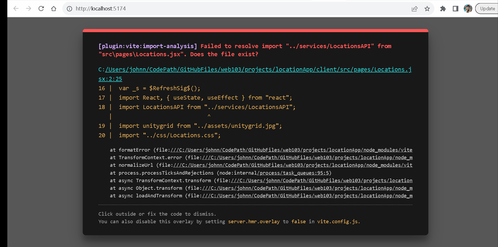

# LocationApp
Submitted by: Johnny A. Cortez

A fun web app that allows you to find events from different locations. I used PostgreSQL as the backend. 

## Features

The following **required** functionality is completed:

-The web app uses React to display data from the API.
-The web app is connected to a PostgreSQL database, with an appropriately structured events table.
-The web app displays the title of the app.
-A visual interface allows the user to select a location they would like to view.
-Clicking on a location shows a list of all items from the events table that corresponds to that location.
-Each location detail page should have its own unique URL.

## Video Walkthrough

Here's a walkthrough of implemented features:

GIF created with ScreenToGif

## Notes

## License

    Copyright [2023] [Johnny A. Cortez]

    Licensed under the Apache License, Version 2.0 (the "License");
    you may not use this file except in compliance with the License.
    You may obtain a copy of the License at

        http://www.apache.org/licenses/LICENSE-2.0

    Unless required by applicable law or agreed to in writing, software
    distributed under the License is distributed on an "AS IS" BASIS,
    WITHOUT WARRANTIES OR CONDITIONS OF ANY KIND, either express or implied.
    See the License for the specific language governing permissions and
    limitations under the License.
